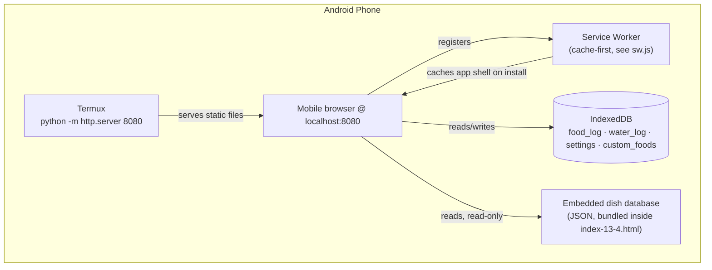

# Architecture

## Summary

MealMind is a single static HTML file. There is no backend, no API, and no build step. Everything below happens inside one phone.

## Why Termux + a local Python server, instead of just opening the file directly

Opening `index-13-4.html` straight from disk (`file://…`) works for the UI, but two browser platform features that the offline story depends on are unavailable or unreliable under `file://`:

1. **Service workers.** Browsers only register a service worker in a [secure context](https://developer.mozilla.org/en-US/docs/Web/Security/Secure_Contexts) — HTTPS, or `localhost`. `file://` does not reliably qualify across mobile browsers.
2. **The "Add to Home Screen" install flow** and manifest-driven `standalone` display mode behave more consistently when served over HTTP(S) than from a raw file path.

Running `python -m http.server 8080` inside Termux turns the phone into its own (extremely minimal) web server. The browser then talks to `http://localhost:8080`, which mobile browsers treat as a secure context, so the service worker registers and caches normally — with no internet connection involved anywhere in that chain.

## Offline behavior: the service worker

`sw.js` uses a cache-first strategy for the three files the app needs to run (`index-13-4.html`, `manifest.json`, `icon.png`):

- **On install**, it pre-caches those three files.
- **On every fetch**, it serves from cache immediately if present; otherwise it fetches from the network and stores a copy for next time.
- **On activate**, it clears out any old cache version, so bumping `CACHE_NAME` in `sw.js` is how you ship an update.

This is what makes the "Airplane Mode Proof" reproducible on a device that has only ever loaded the page once — not dependent on the browser's ordinary HTTP cache, which isn't guaranteed to survive a cold reload or a cache clear.

## IndexedDB schema

Database: `VegNutritionTrackerDB`, version 1. Four object stores:

| Store | Key | Purpose |
|---|---|---|
| `food_log` | auto-increment, indexed by `byDate` | Every logged meal entry |
| `water_log` | `date` | Daily water intake |
| `settings` | `id` | User preferences (goals, targets, display options) |
| `custom_foods` | `id` | User-added dishes not in the bundled database |

All four stores live entirely in the browser's local storage for that origin. Nothing here is synced anywhere. A built-in export writes all four stores to a single JSON file (with a schema-version marker), and import validates that marker plus the expected keys before writing anything back — so a malformed or foreign file is rejected rather than partially applied.

## The dish database itself

The ~1,600-dish database is a plain JSON array embedded directly in `index-13-4.html` — no separate fetch, no API call, no lazy loading. It loads with the page and is available immediately, including offline. See [`DATA_SOURCES.md`](DATA_SOURCES.md) for what's actually in each entry and how search/matching works.
