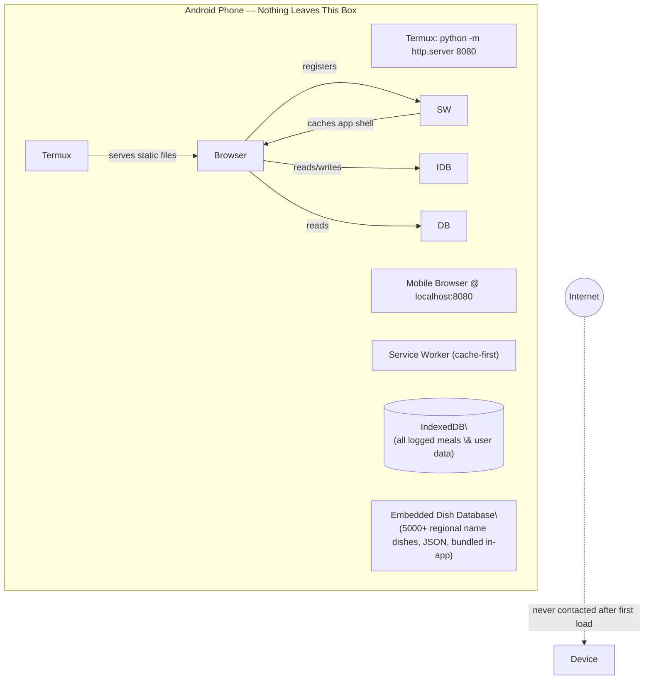

<p align="center">
  
</p>

<h1 align="center">MealMind</h1>
<p align="center"><b>Nourish a Better You</b> — offline-first nutrition tracking built for how India actually eats.</p>

<p align="center">
  
  
  
  
</p>

\---

## The problem

Most nutrition apps are built around Western food databases and Western behavior science. Neither fits well here:

* **The data doesn't fit.** Regional rotis, street food, dal varieties, and thousands of local names for the same or similar dishes aren't a rounding error in a US-built food database — they're missing entirely.
* **The UX doesn't fit.** Streaks, red warning banners, and calorie-shaming push people toward disordered, guilt-driven tracking instead of sustainable habits.

MealMind is a single-file, offline-first PWA that fixes both: a hyperlocal Indian vegetarian food database, and a **zero-guilt** logging experience with no streak-breaks, no shaming copy, and no negative reinforcement loops — just private, sustainable tracking.

## The "Airplane Mode Proof"

MealMind's core claim is architectural, not cosmetic: **there is no backend.** No accounts, no login, no analytics, no Firebase, no remote API calls — ever. All food data ships inside the app, and all personal logs live in the browser's IndexedDB, on-device, for the lifetime of the app. A built-in export/import lets you back up or move that data yourself — file-based, on-device, still zero-cloud.

> 🎥 https://youtube.com/shorts/2sRPMcYKELY?si=8JOG6Kh2BmR_WXSh\

## Try it

|||
|-|-|
|**Live demo**|(https://aadityanilajagi00918.github.io/Meal-Mind/)|
|**Run locally (edge-execution demo)**|See [Run via Termux](#run-via-termux-edge-execution-demo) below|

## Architecture



`localhost` is treated as a [secure context](https://developer.mozilla.org/en-US/docs/Web/Security/Secure_Contexts) by mobile browsers, so a real installable, offline-capable service worker works even though the "server" is just a one-line Python process running on the phone itself. See [ARCHITECTURE.md`](ARCHITECTURE.md) for the full breakdown.

## Zero-guilt UX

No streaks to break. No red "you're over budget" banners. No calorie-shaming copy. The goal is a tool people keep using for years, not one they delete after a week of guilt.

## Hyperlocal, compliance-aware food data

Every dish entry carries more than a calorie count:

* **Provenance** (`data\_basis`): IFCT 2017, USDA FoodData Central, manufacturer label, or a documented recipe estimate — never an unsourced guess.
* **Compliance flags**: Jain-diet status, Vrat/fasting status, and egg status, so the app can answer "can I eat this today" questions a generic tracker can't.
* **Regional name coverage**: 5,000+ searchable dish names and regional spellings across 1,600+ curated dishes spanning 32 categories — try searching "Kanda Poha" or "Patal Poha" and watch it resolve straight to the right entry. See [`SOURCES.md`](DATA_SOURCES.md) for exactly how this works and where every number in this README comes from.

## Tech stack

|Layer|Choice|Why|
|-|-|-|
|UI|Vanilla HTML/CSS/JS, single file|Zero build step, zero dependencies, trivially auditable|
|Storage|IndexedDB|On-device, structured, no server needed|
|Offline|Service Worker (cache-first)|Real offline guarantee, not just browser HTTP cache luck|
|Local runtime|Termux + `python -m http.server`|Demonstrates edge execution on commodity Android hardware|
|Hosting (demo)|GitHub Pages|Free, static, reviewed and tryed in two seconds|

## Data sources \& privacy

* [ SOURCES.md`](DATA_SOURCES.md) — where the numbers come from, and how dish search/matching actually works
* [`PRIVACY.md`](PRIVACY.md) — the zero-cloud data policy, in plain language
* [ ARCHITECTURE.md`](ARCHITECTURE.md) — the edge-execution model and IndexedDB schema

## Run via Termux (edge-execution demo)

```bash
pkg install python
cd mealmind
python -m http.server 8080
```

Then open `http://localhost:8080/index-13-4.html` in your phone's browser. Turn on airplane mode after the first load and it keeps working — that's the point.

## License

MIT — see [`LICENSE`](LICENSE).

