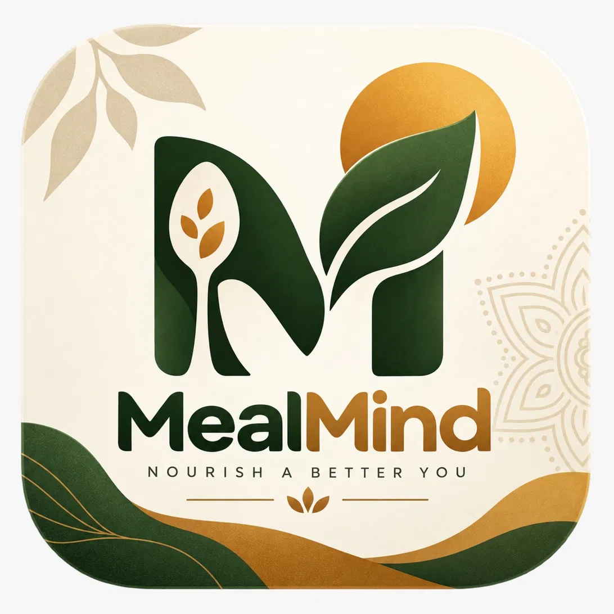
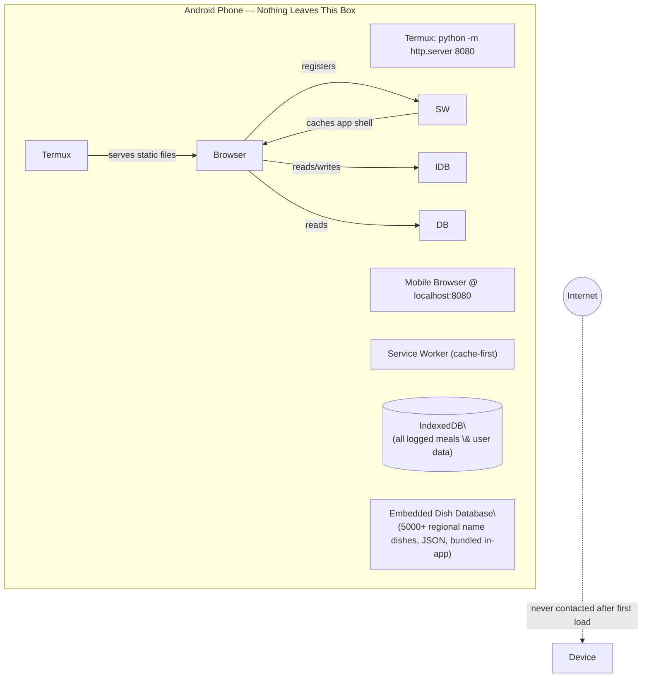

<p align="center">
  
</p>

<h1 align="center">MealMind</h1>
<p align="center"><b>Nourish a Better You</b> — offline-first nutrition tracking built for how India actually eats.</p>

<p align="center">
  
  
  
  
</p>

\---

## The Problem: A Global Crisis & The Indian Access Gap

**The Scale of the Health Crisis**
Nutrition is at the core of a massive global health emergency. Worldwide, over **589 million adults** are living with diabetes, and more than **1 billion** are living with obesity. In India alone, over 100 million people have diabetes. These are not just medical problems; they are problems deeply connected to our daily food intake. 

**The Hidden Micronutrient Deficit**
Understanding what we eat in India is not as simple as counting calories. Micronutrient inadequacy is a severe, often overlooked issue, particularly concerning Vitamin B12 in vegetarian diets:
* According to the **Indian Migration Study**, **35.1%** of vegetarian participants had a B12 intake below the recommended allowance, compared with just 12.6% of non-vegetarians.
* A systematic review covering **270 Indian studies** found substantial evidence of widespread micronutrient deficiencies across studied populations.

**The Access Gap**
Telling people to simply "eat better" does not work if they lack practical tools. While detailed nutrition guidance exists, it typically requires significant time, money, clinical expertise, or access to professional help. Furthermore, generic western fitness trackers completely fail to capture the nuance of regional Indian diets. *The fix works. Access doesn't.*

---

## 💡 The Solution: Bridging the Gap with Edge Computing

Meal Mind bridges this access gap by proving that detailed nutrition tracking can be performant, culturally nuanced, and 100% accessible to anyone with a smartphone. 

* **Hyper-Localized Database:** Features 5,000+ Indian regional dishes, calculating complex macronutrients and 11 critical micronutrients (including B12) instantly.
* **100% Offline & Edge-Computed:** Runs entirely on the device via an Android Termux Python server and IndexedDB storage. Zero network latency means users without reliable internet can still track their health seamlessly.
* **Zero Cloud, Absolute Privacy:** By eliminating centralized backend infrastructure, user data never leaves the physical handset. No accounts, no dietitians, no SaaS subscriptions, and zero cost—completely removing the financial and privacy barriers to detailed nutrition tracking.


## The "Airplane Mode Proof"

MealMind's core claim is architectural, not cosmetic: **there is no backend.** No accounts, no login, no analytics, no Firebase, no remote API calls — ever. All food data ships inside the app, and all personal logs live in the browser's IndexedDB, on-device, for the lifetime of the app. A built-in export/import lets you back up or move that data yourself — file-based, on-device, still zero-cloud.

> 🎥 https://youtube.com/shorts/2sRPMcYKELY?si=8JOG6Kh2BmR_WXSh\

## Try it

|||
|-|-|
|**Live demo**|https://aadityanilajagi00918.github.io/Meal-Mind|
|**Run locally (edge-execution demo)**|See [Run via Termux](#run-via-termux-edge-execution-demo) below|

## Architecture



`localhost` is treated as a [secure context](https://developer.mozilla.org/en-US/docs/Web/Security/Secure_Contexts) by mobile browsers, so a real installable, offline-capable service worker works even though the "server" is just a one-line Python process running on the phone itself. See [ARCHITECTURE.md`](ARCHITECTURE.md) for the full breakdown.

## Zero-guilt UX

No streaks to break. No red "you're over budget" banners. No calorie-shaming copy. The goal is a tool people keep using for years, not one they delete after a week of guilt.

## Hyperlocal, compliance-aware food data

Every dish entry carries more than a calorie count:

* **Provenance** (`data\_basis`): IFCT 2017, USDA FoodData Central, manufacturer label, or a documented recipe estimate — never an unsourced guess.
* **Compliance flags**: Jain-diet status, Vrat/fasting status, and egg status, so the app can answer "can I eat this today" questions a generic tracker can't.
* **Regional name coverage**: 5,000+ searchable dish names and regional spellings across 1,600+ curated dishes spanning 32 categories — try searching "Kanda Poha" or "Patal Poha" and watch it resolve straight to the right entry. See [`SOURCES.md`](DATA_SOURCES.md) for exactly how this works and where every number in this README comes from.

## Tech stack

|Layer|Choice|Why|
|-|-|-|
|UI|Vanilla HTML/CSS/JS, single file|Zero build step, zero dependencies, trivially auditable|
|Storage|IndexedDB|On-device, structured, no server needed|
|Offline|Service Worker (cache-first)|Real offline guarantee, not just browser HTTP cache luck|
|Local runtime|Termux + `python -m http.server`|Demonstrates edge execution on commodity Android hardware|
|Hosting (demo)|GitHub Pages|Free, static, reviewed and tryed in two seconds|

## Data sources \& privacy

* [ SOURCES.md`](DATA_SOURCES.md) — where the numbers come from, and how dish search/matching actually works
* [`PRIVACY.md`](PRIVACY.md) — the zero-cloud data policy, in plain language
* [ ARCHITECTURE.md`](ARCHITECTURE.md) — the edge-execution model and IndexedDB schema

## Local Developer Setup (Android / Termux)

**MealMind** is designed to run completely offline. You can host the entire Progressive Web App natively on an Android device using a **local Python HTTP server**.

**1. Install Prerequisites in Termux**
Open Termux and install **Git** and **Python**:
```bash
pkg update && pkg upgrade
pkg install git python
```

**2. Clone the Repository**
Pull the codebase and navigate into the directory:
```bash
git clone [https://github.com/aadityanilajagi00918/Meal-Mind.git](https://github.com/aadityanilajagi00918/Meal-Mind.git)
cd Meal-Mind
```

**3. Launch the Local Server**
Start the Python HTTP server on **port 8080**:
```bash
python -m http.server 8080
```

**4. Access the Application**
Open **Google Chrome** (or your preferred mobile browser) and navigate to the local loopback address:
**`http://localhost:8080`**

## License

MIT — see [`LICENSE`](LICENSE).

